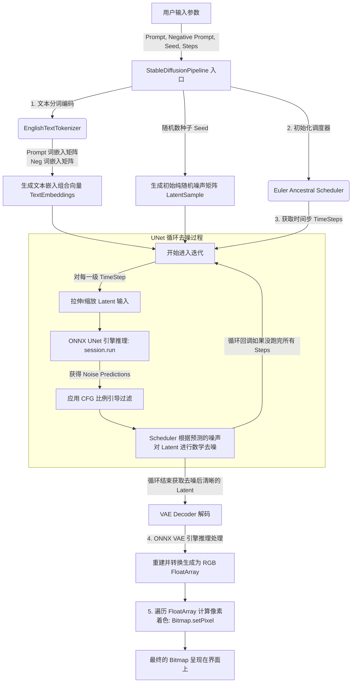

# Stable Diffusion 基于 ONNX Runtime 的本地化图像生成原理与流程指南

本文档旨在为你在 Android 平台上利用 ONNX Runtime (ORT) 跑通本地 Stable Diffusion (SD) 提供详尽的原理解析和操作流程说明。通过这些步骤，我们可以在脱离服务端的手机（或平板）本地实现真正意义上的 AI 绘画。

## 一、 核心组件架构

在 `BookCompose/ONNX` 模块中，我们将 Stable Diffusion 的四大核心拆分成了相互关联的独立类：
1. **Tokenizer (分词器)**：将人类语言（Prompt）编码为机器能理解的词嵌入矩阵向量。
2. **Scheduler (调度器)**：根据迭代步长（Steps）管理噪声，提供去噪模型所需的数学基础规模信息。
3. **UNet**：核心的去噪模型引擎，在潜在空间 (Latent Space) 里面反复循环预测和去除噪声。
4. **VAE (变分自编码解码器)**：负责把潜在空间（Latent Space）中的矩阵像素解压缩、渲染成为一张肉眼可见的、颜色丰富的 RGB 图片（Bitmap）。

---

## 二、 完整生成图像流程图

下面是我们代码执行时，生成一张 AI 图像的整体工作流：

[![](https://mermaid.ink/img/pako:eNqFVotO20gU_ZWRV5W6UkgT8irRqlJTAqrEAuJRrdagaoInwapjR7azghIk2lIICwQQr9JCX7SFVoWgqhRIWPgZZuz8xc54TGoiVmtLln3vmXPPfcwkY8KQJiEhLmR0mBsGfa0DKqDXjRvAWtklxSP7bBk__8iN_QbSRa8ZLzwlqweDoKnpDih061o2Z_pAJ8pAU_4LgUtDL0ISfZooZxRAQuw1YUpBrXI6nTdkTe2Wc0iRVQQcvu1BHqquok97hFT5MdJB7cUPsn_IHQkeMugHZG2abH7FxSm7PG-drllvnxRA36OHSZWldTOpZhTZGO5DI2ad6FdOUQd51QPKgg_nqBTrzefai0PwW0q_dYel1OgpgGQ2RYvxhhQXXQ3cW53Ei0W8uFSbXgAsLoUhSZLVjNGYGt74grcPOAUubuGdWTy3diW_2ssFslmhJbZ25vHeolPJAujUZAOJ3nVWpcyhLiXX3gFNpJq9MJtTUGPs_k5kAnz2xSqVvXWlYp3I_Z3JvocdXV3d3OxEvM7h6mz2g3oC9sEzXPmEN3YLoHdoGEk3k3mFdu-uOoQMU4cKtzKb2wjnm_OE_MAuHeGFNbL-o7b-nex9BH1yFrmj0xCbP418ik9uK1KpSlpn0KFpOSB6MsSlKi2MfT5t7c66hXDG-ZJPxKcTVLx9_oo20D7fu6huuzONyyekvHBxPGFVdupSWGJQQSKZnbk4Pb5lnX4mK2dutQHfGJ4oDtZhu6-mkY5oHcSuzs4_3BacrpLlEintWotTcWAgg20Jv55XPQz1dVwTq9DZutuTbh1J8pBJF9ECtedlScSVFbpFwb22dkDKKxdnszQELp_S7En1g4eVgR1ClpJYbwogb0_I_H7t_SQ5nLVeTvKJonWoJ3j-yn43R2cS733ihfUmS7ncyvHKv3rN5uHTU_J6k3x7Zx8t4f05MjNBNmfA9V1FqtQwqvbONt3V3iltjGJVl8nWGz45XBJeLJHj52TjgGbgCi_QCWHbXXxwN-m-6i63mwA3cuKwHzhNYmBvj_CHSfosgJ72hFibnsfVCj75Yf_zlcy_5xvy4rjCnKBN0aB5V9fhqMvOjIw6IZtZmBMjflB7Mo9LUx4ksPffWfvr-NmC9f2ttTVhz3yLu3i_gcxueQQpVzYy9_GNeV8kmxNWtcgydu14qWiVDvDmrrU6V9t6f3H896Dgowe9LAnxNFQM5BOySM9C9i2MMcoBwRxGWTQgxOlrChr0zeexP4C6zA5vgwHGXCUCHDI1PfEow1f9kriXSLYl3YU__ZpOC-5CYATGULQRwk7Le5qiXaJCoVAjpE1TzTaYlZVRjrmvmkj3gR4tpZmaDxhQNZroj5Scvm5hLz39-bJgJDfSiOiGzinNAMHAddp7oCTnncyDzXW_IWdUqHhVpyR2e9g5pDG5WITdHpgCU0hJaCO0kF4cSqN0On0dzhHlhUoBKXAVSg_C_41L26_-bF7auTxuHQ2Z7bqWzzXoSkv0vh74n8IYdHxAHadDmIPqn5qWFeKmnqdjSNdlhi8_8jmJ7thWGdKDPVufVHoCOrR51RTiwWjY4RDiY8KIEG-K3vaHYy3NgXCkORIONoeod5SiYgF_KNgcbolFYy2haCAaGvcJj52wAf_tWLiFXZFoS0sgyvjoSUqb_Tv_O-T8Kxr_F0hiqds?type=png)](https://mermaid.live/edit#pako:eNqFVotO20gU_ZWRV5W6UkgT8irRqlJTAqrEAuJRrdagaoInwapjR7azghIk2lIICwQQr9JCX7SFVoWgqhRIWPgZZuz8xc54TGoiVmtLln3vmXPPfcwkY8KQJiEhLmR0mBsGfa0DKqDXjRvAWtklxSP7bBk__8iN_QbSRa8ZLzwlqweDoKnpDih061o2Z_pAJ8pAU_4LgUtDL0ISfZooZxRAQuw1YUpBrXI6nTdkTe2Wc0iRVQQcvu1BHqquok97hFT5MdJB7cUPsn_IHQkeMugHZG2abH7FxSm7PG-drllvnxRA36OHSZWldTOpZhTZGO5DI2ad6FdOUQd51QPKgg_nqBTrzefai0PwW0q_dYel1OgpgGQ2RYvxhhQXXQ3cW53Ei0W8uFSbXgAsLoUhSZLVjNGYGt74grcPOAUubuGdWTy3diW_2ssFslmhJbZ25vHeolPJAujUZAOJ3nVWpcyhLiXX3gFNpJq9MJtTUGPs_k5kAnz2xSqVvXWlYp3I_Z3JvocdXV3d3OxEvM7h6mz2g3oC9sEzXPmEN3YLoHdoGEk3k3mFdu-uOoQMU4cKtzKb2wjnm_OE_MAuHeGFNbL-o7b-nex9BH1yFrmj0xCbP418ik9uK1KpSlpn0KFpOSB6MsSlKi2MfT5t7c66hXDG-ZJPxKcTVLx9_oo20D7fu6huuzONyyekvHBxPGFVdupSWGJQQSKZnbk4Pb5lnX4mK2dutQHfGJ4oDtZhu6-mkY5oHcSuzs4_3BacrpLlEintWotTcWAgg20Jv55XPQz1dVwTq9DZutuTbh1J8pBJF9ECtedlScSVFbpFwb22dkDKKxdnszQELp_S7En1g4eVgR1ClpJYbwogb0_I_H7t_SQ5nLVeTvKJonWoJ3j-yn43R2cS733ihfUmS7ncyvHKv3rN5uHTU_J6k3x7Zx8t4f05MjNBNmfA9V1FqtQwqvbONt3V3iltjGJVl8nWGz45XBJeLJHj52TjgGbgCi_QCWHbXXxwN-m-6i63mwA3cuKwHzhNYmBvj_CHSfosgJ72hFibnsfVCj75Yf_zlcy_5xvy4rjCnKBN0aB5V9fhqMvOjIw6IZtZmBMjflB7Mo9LUx4ksPffWfvr-NmC9f2ttTVhz3yLu3i_gcxueQQpVzYy9_GNeV8kmxNWtcgydu14qWiVDvDmrrU6V9t6f3H896Dgowe9LAnxNFQM5BOySM9C9i2MMcoBwRxGWTQgxOlrChr0zeexP4C6zA5vgwHGXCUCHDI1PfEow1f9kriXSLYl3YU__ZpOC-5CYATGULQRwk7Le5qiXaJCoVAjpE1TzTaYlZVRjrmvmkj3gR4tpZmaDxhQNZroj5Scvm5hLz39-bJgJDfSiOiGzinNAMHAddp7oCTnncyDzXW_IWdUqHhVpyR2e9g5pDG5WITdHpgCU0hJaCO0kF4cSqN0On0dzhHlhUoBKXAVSg_C_41L26_-bF7auTxuHQ2Z7bqWzzXoSkv0vh74n8IYdHxAHadDmIPqn5qWFeKmnqdjSNdlhi8_8jmJ7thWGdKDPVufVHoCOrR51RTiwWjY4RDiY8KIEG-K3vaHYy3NgXCkORIONoeod5SiYgF_KNgcbolFYy2haCAaGvcJj52wAf_tWLiFXZFoS0sgyvjoSUqb_Tv_O-T8Kxr_F0hiqds)

---

## 三、 各步骤代码层次实现详解

### 第一步：模型动态下载与准备
`ModelDownloader.kt` 负责检查本地存储目录是否存在指定的 ONNX `.ort` 序列化文件和词表 `.json`。
*   如果不存在：利用 `HttpURLConnection` 和 `ZipInputStream` 流式下载并解压大型模型文件（如 1.1GB）。
*   为什么放到本地文件 (`filesDir`) 而不是 Android `assets` 目录？
    *   放置过大的文件在 assets 中会导致 APK 体积极剧膨胀，安装失败。
    *   通过绝对路径读取 (`ModelLoader.kt`), 调用 `ONNX ORT` 通过文件句柄映射到物理内存以避免 Java OOM (Out Of Memory) 内存溢出。

### 第二步：文本词汇嵌入 (Text Embedding)
在 `EnglishTextTokenizer.kt` 中：
1. **加载字典**：读取 `vocab.json` 和 `merges.txt`，把诸如 "mountain", "beautiful" 这样的英语词根映射为独一无二的整数 ID。
2. **文本向量化**：经过 ONNX `text_encoder/model.ort` 的预处理，最终输出特定形状大小的 Float32 矩阵（例如 $2 \times 77 \times 768$ 表示融合了正向提示和负面提示的文本）。这一步将人类自然语言成功投射到了数学特征空间中。

### 第三步：生成初始噪音向量空间
生成并不是"无中生有"，大模型需要一块“布满无规则雪花噪点的画布”。
1. 通过指定的 `Seed` 随机种子，调用高斯分布(正态分布)随机数生成一个四维数组矩阵（比如 $1 \times 4 \times 48 \times 48$）。
2. 把这个三维数组用 `LocalDiffusionTensor` 以及 ONNX 框架结构装载起来。

### 第四步：核心去噪过程 —— UNet 循环 (Denoising Loop)
这是最关键、耗时最久、也是最耗能的一步，位于 `UNet.kt` 中的 `inference` 方法里。
1. **时间步与调度**：我们想要运行二十步 (steps=20)。调度器 `EulerAncestralDiscreteLocalDiffusionScheduler` 首先生成这 20 步具体的步进值。
2. **多模态融合输入**：对于每一个 Step 步长，将其时间信息、当步的"雪花分布画布 (Latent)"和第二步得到的特征矩阵合并一起，组成 `InputMap`。
3. **ONNX 推理**：执行 `session.run(InputMap)` 操作。在强大的算力支持下，`unet/model.ort` 模型发挥威力，输出当前步下**"到底哪些像素是雪花"**的预测值。
4. **CFG (Classifier Free Guidance)**：预测值经过正向与负向差异放大，从而迫使内容更靠拢你的 Prompt 参数。
5. 去掉雪花：调度器将预测好的这一层"雪花"从"画布"上扣去，循环进入下一个时间步，画布越来越清晰。最终脱胎于初始随机噪声的、干净且有结构的特征隐变量被计算出来。

### 第五步：将潜在特征域转换为可视的图片 (VAE Decoder)
在 `VaeDecoder.kt` 以及 `decode()` 方法里：
1. 此时取得的清晰潜变量 (Latent) 尺寸其实非常小，不仅小，它也不是普通的图片像素值。
2. 调度最后一步，调用 `vae_decoder/model.ort`，该模型的功能就是把高维极小的数学特征放大还原，变回 $3 \times 384 \times 384$ （通道、高、宽）的数组。
3. `convertToImage()` 函数里通过简单的色彩转换逻辑，把这些浮点数 Clamp 限制在 $0\sim255$ 范围内，赋值给 Android 提供基础系统级的 `Bitmap` 的每一个微小的像素。

最终，一幅基于你描述信息的图像呈现在 UI(`OnnxScreen.kt`) 界面上。
